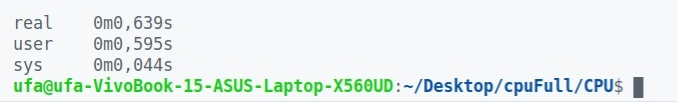
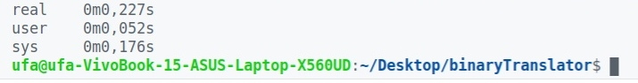

# binaryTrAMAGOCHI

> The binary translator, which convert binary code after [my assembler](github.com/Exactlywb/assembler) into x86_64 binary code.

## Background

The last project in [@ded32](github.com/ded32) course held in [MIPT](https://mipt.ru/).

## The task

To implement the binary translator using [JIT-compilation](en.wikipedia.org/wiki/Just-in-time_compilation). 

## The bottom line of the project

_JIT-compilation_ or _Just-in-time compilation_ has its benefits such as 

* The flexibility of interpretation
* The program execution speed

By the way I have to notice that similar approach is implemented in _Java_, _Lua_, _PHP_ and other programming languages.

## How to run binaryTrAMAGOCHI?

If you suddenly become an outcast among programmers and decide to code in [my assembler](github.com/Exactlywb/assembler) you may run binaryTrAMAGOCHI in the following way:
```
>./main fileName.fr
```

Where  ``` _fileName.fr_ ``` is the binary code you get after using my assembler.

## The results

The main goal which we had to achive was the boost of executive [program](test/factorial.fr). Let's compare both run-times: after our CPU emulator and after binary translator:

<p align = "center">
    
</p>

<p align = "center">
    
</p>

As we can see, binaryTrAMAGOCHI is eleven times faster!

<p align = "center">
    
</p>
