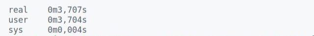
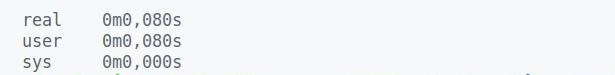
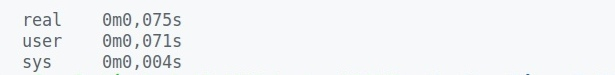
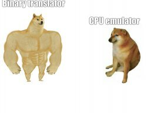

# binaryTrAMAGOCHI
the binary translator which converts binary code after [my assembler](github.com/Exactlywb/assembler) into x86_64 binary code.

## Background

The last project in [@ded32](github.com/ded32)  "Computer Architecture" course held in [MIPT](https://mipt.ru/).

## The task

To implement the binary translator using [JIT-compilation](en.wikipedia.org/wiki/Just-in-time_compilation). 

## The bottom line of the project

_JIT-compilation_ or _Just-in-time compilation_ has its benefits such as 

* The flexibility of interpretation
* The program execution speed

By the way I have to notice that similar approach is implemented in _Java_, _Lua_, _PHP_ and other programming languages.

## How to run binaryTrAMAGOCHI?

If you suddenly become an outcast among programmers and decide to code in [my assembler](github.com/Exactlywb/assembler) you may run binaryTrAMAGOCHI in the following way:
```
>./main fileName.fr
```

where  ``` _fileName.fr_ ``` is the binary code you get after using my assembler.

## Optimization of the assembly code

After analyzing our output file we may see a lot of useless repeating code. This problem exists due to code generation. As a way to get rid of that trash code we may make up some templates and process them separately. 

* ### The first template we may optimize is the following part of the code (the code is given in [assembly language]()):

```x86asm
push    10
pop     rax
```

This part of the code is converted into:

```x86asm
jmp 0x400272

db      0x00                     ;0x40026a adress    ;
db      0x00                     ;                   ;
db      0x00                     ;                   ;
db      0x00                     ;                   ;
db      0x00                     ;OUR NUMBER         ;
db      0x00                     ;                   ;
db      0x24                     ;                   ;
db      0x40                     ;                   ;push 10
                                                     ;
                                 ;0x400272 adress    ;
movsd   xmm7, [0x40026a]                             ;
sub     rsp, 8                                       ;
movsd   [rsp], xmm7                                  ;

movsd   xmm0, [rsp]                                  ;
add     rsp, 8                                       ;pop rax
```

As we can see we have the useless commands that put our number into stack and then get it back. Let's implement the function which handles this code in a proper way:

```cpp
bool PushNumPopRegOptimization (char* JITBuffer, InputByteCode* _byteCodeStruct) {

    size_t skippedBytes = 0;

    char mode [3] = "";
    ReadModeFromInputBuffer (mode, _byteCodeStruct);
    skippedBytes += 3;

    size_t labelBeforeNumber = 0;

    if (CheckMode (mode, 1, 0, 0)) {                                    //push num

        labelBeforeNumber = PushNumberLikeBytes (JITBuffer, _byteCodeStruct);      
        skippedBytes += sizeof (double);
    
    } else {

        ReturnSkippedBytes (_byteCodeStruct, skippedBytes);
        return false;

    }

    skippedBytes++;
    if (ReadCharFromInputByteCode (_byteCodeStruct) == pop) {

        ReadModeFromInputBuffer (mode, _byteCodeStruct);
        skippedBytes += 3;

        if (CheckMode (mode, 0, 1, 0)) {                                 //pop reg

            char xmmPostfix = ReadCharFromInputByteCode (_byteCodeStruct);
            PutCommandsIntoByteCode (JITBuffer, 5, 0xF2, 0x0F, 0x10, 0x4 + 8 * xmmPostfix, 0x25);

            *(size_t*)(JITBuffer + PROGRAM_SIZE) = labelBeforeNumber;                       
            PROGRAM_SIZE += 4;

            return true;

        } else {

            ReturnSkippedBytes (_byteCodeStruct, skippedBytes);
            PROGRAM_SIZE -= sizeof (double);

            return false;

        }

    } else {

        ReturnSkippedBytes (_byteCodeStruct, skippedBytes);
        PROGRAM_SIZE -= sizeof (double);
        return false;

    }

}
```

Now the code mentioned before is converted into:
```x86asm
jmp 0x400272

db      0x00                     ;0x40026a adress    
db      0x00                     ;                   
db      0x00                     ;                   
db      0x00                     ;                   
db      0x00                     ;OUR NUMBER         
db      0x00                     ;                   
db      0x24                     ;                   
db      0x40                     ;                   
                                                
                                 ;0x400272 adress    
movsd   xmm0, [0x40026a]
```

Now we have the real result: instead of obviously doing ```push-pop``` we just do ```mov xmm0, [0x40026a]```. It's real great.

* ### Let's go on and give the other simple template:

```x86asm
push    <anything>
pop
```

This part of the code doesn't make sense with the code. So the best way just to skip it.

Let's implement the similar function that transforms the given part of the code into a proper one:

```cpp
bool PushPopOptimization (char* JITBuffer, InputByteCode* _byteCodeStruct) {

    size_t skippedBytes = 0;

    char mode [3] = "";
    ReadModeFromInputBuffer (mode, _byteCodeStruct);
    skippedBytes += 3;

    if (CheckMode (mode, 1, 0, 0)) {                                    

        SkipNumberInByteCode (_byteCodeStruct);                         //skip number
        skippedBytes += sizeof (double);

    } else if (CheckMode (mode, 0, 1, 0)) {

        ReadCharFromInputByteCode (_byteCodeStruct);                    //skip register
        skippedBytes++;

    }

    skippedBytes++;
    if (ReadCharFromInputByteCode (_byteCodeStruct) == pop) {

        ReadModeFromInputBuffer (mode, _byteCodeStruct);
        skippedBytes += 3;

        if (CheckMode (mode, 0, 0, 0))                                   //pop
            return true;
        else
            ReturnSkippedBytes (_byteCodeStruct, skippedBytes);

    } else
        ReturnSkippedBytes (_byteCodeStruct, skippedBytes);

    return false;

}
```

## The conclusion

The main goal we wanted to achive was the boost of executive [program](test/factorial.fr) run-time. Let's compare both run-times: after our CPU emulator and after the binary translator without the [optimization]():

<p align = "center">
    
</p>

<p align = "center">
    
</p>

As we can see, binaryTrAMAGOCHI is 46 times faster!

Now let's compare the run-time using the optimization we have implemented:

<p align = "center">
    
</p>

As we can see our optimization gives us the boost of 11%!

<p align = "center">
    
</p>
